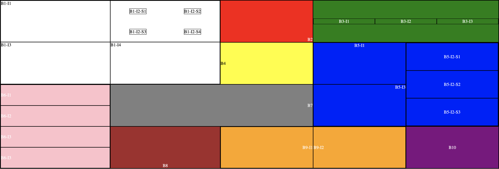

# Instructions  

---

Use the topics we've learned so far to recreate this picture by editing only the 'style.css' file:



In the screenshot, the letter B stands for box. There are 10 boxes, arranged into five columns and four rows like this:
```
    1 1 2 3 3
    1 1 4 5 5
    6 7 7 5 5
    6 8 9 9 10
```

In the screenshot, the letter I stands for item. Some of the boxes have other `<div>` elements inside them. These divs split the box into rows, columns, or a grid. In the case where the box is split into a grid, the grid's contents are labelled S (for 'subitem') and numbered.

Altogether, there are three levels of organization in this project (from lowest to highest): boxes, items, and subitems.

Your job is to add to the 'style.css' file in order to recreate the image. You will only need to add lines that use the following code:
```
  display: flex/grid;
  grid-template-areas: <grid areas>;
  grid-template-columns: <column sizes>;
  grid-template-rows: <row sizes>;
  grid-area: <grid area name>;
  flex: <flex shorthand number>;
  flex-direction: row/column;
  align-items: start/center/end;
  justify-content: start/center/end;
```

You will not need to add any selectors to the stylesheet; you will only need to add code to the existing selectors. You should not remove any lines of code from the stylesheet, only add.

Get your code looking as close as possible to the picture. Make sure to take your time and think before writing each line of code (don't simply try every combination without thinking). Good luck!